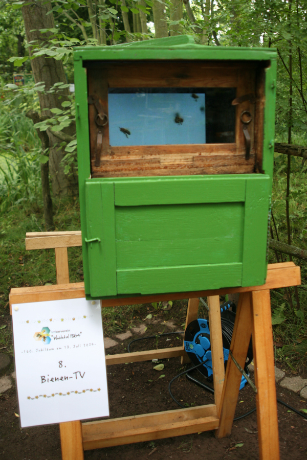

Zur 160-Jahrfeier unseres [Imkervereins Wuhletal 1864
e.V.](https://imkerverein-wuhletal1864.de/) wollten wir den Besuchern
gerne Lehrfilme zeigen. Aufgrund der sonnigen Lichtverhältnisse
suchten wir nach Alternativen zu Projektion und Leinwand und kamen auf
die Idee, einen Bildschirm in eine ausgediente Beute einzubauen. Somit
war die "Videobeute" als Ausstellungs- und Schulungsobjekt für unseren
Bienenlehrgarten geboren.

# Hardware

- Hinterbehandlungsbeute Deutsch-Normalmaß
- 14-Zoll Flachbildschirm im Format 4:3
- Raspberry Pi 3
- Waveshare WM8960 Audio­HAT
- zwei kleine Lautsprecher
- ggf. zwei Taster zur Lautstärkeregelung
- USB-Netzteil
- Verbindungskabel

# Software

Auf dem Raspberry Pi läuft der Mediaplayer [mpv](https://mpv.io/) in
einer Endlosschleife ([run.sh](bin/run.sh)) in der verschiedene
Lehrfilme gezeigt werden, darunter das Video
[Wabenbau](https://www.youtube.com/watch?v=MRuAMkRgnEE) von [Hansi
Raber](https://www.youtube.com/hansiraber).

# Dokumentation
- [Git-Repo](https://github.com/rjoberon/videobeute)
- [Infozettel](doc/infozettel.sla) (Scribus-Dokument)
- Fotos: [vorn](img/videobeute_vorn.jpg), [hinten](img/videobeute_hinten.jpg), [innen](img/videobeute_video.jpg)
